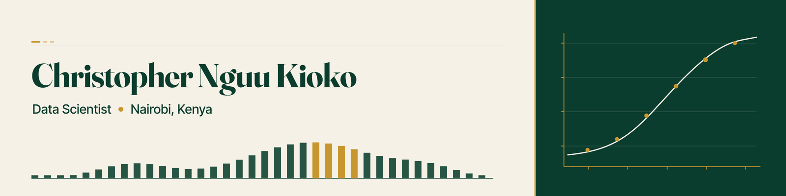

# Hi, I'm Christopher Nguu 👋

**Christopher Nguu Kioko** · Data Scientist · Nairobi, Kenya

I'm a data scientist in Nairobi doing an MSc in Data Science at Strathmore University. I care most about the part of machine learning that happens after the notebook: leak-free pipelines, one shared preprocessing path for training and serving, honest metrics, and models that send low-confidence predictions to a human. My projects sit on East African problems (mobile-money fraud, telecom customer care, county-level health capacity), and I ship them as working APIs and apps rather than leaving them as slides.

- 📊 **Data Scientist**: ML models from baseline to deployed API (TensorFlow/Keras, scikit-learn, FastAPI, Docker)
- 🎓 **MSc Data Science, Strathmore**: Applied ML coursework (DSA 8401), built as reproducible, leak-free labs
- 🔭 **Currently building**: the *Nairobi Fintech Fraud Flag API* for the UNECA African AI Innovators showcase
- 🛠️ **Builder**: full-stack products for Kenyan clients and teams (Next.js, React, Supabase, Django)
- 🌍 **Based in**: Nairobi, Kenya

## Activity

<table>
  <tr>
    <td valign="top" width="34%">
      
    </td>
    <td valign="top" width="33%">
      
    </td>
    <td valign="top" width="33%">
      
    </td>
  </tr>
</table>

## Tools in the public repos

Badges only where a dependency file, a workflow, or the language breakdown shows the tool.

  
  
  
  
  
  
  
  
  
  

## Telecom customer analytics series

An independent portfolio series built alongside my MSc in Data Science, using public and labelled synthetic data. It is unrelated to the client builds listed below.

| Project | What it does | Key result |
|---|---|---|
| [**telco-churn-nba-engine**](https://github.com/ChristopherKiokoStrathmore/telco-churn-nba-engine) | churn and next-best-action scoring API (FastAPI, Docker) on the public IBM Telco dataset | ROC-AUC 0.846, top-decile lift 2.81 |
| [**responsible-ai-pack**](https://github.com/ChristopherKiokoStrathmore/responsible-ai-pack) | model card, SHAP, Fairlearn fairness audit, drift monitoring and CI metric gates for the churn model | parity gap 0.22 for senior citizens surfaced and disclosed |
| [**omnichannel-care-analytics**](https://github.com/ChristopherKiokoStrathmore/omnichannel-care-analytics) | care journey KPIs and friction analysis | synthetic 4,000-journey log plus public Bitext intent taxonomy |
| [**care-automation-roi**](https://github.com/ChristopherKiokoStrathmore/care-automation-roi) | automation cost-to-serve model, 6 scenarios with payback and sensitivity | 8.5-month base payback (illustrative inputs) |
| [**digital-care-roadmap**](https://github.com/ChristopherKiokoStrathmore/digital-care-roadmap) | Now/Next/Later roadmap, illustrative OKRs and backlog | sequences the series |

## 🔬 Research & Interests

- **Trustworthy ML in production**: training/serving skew, leakage, and routing uncertain predictions to human review
- **Fintech & financial inclusion**: mobile-money fraud signals that don't penalise thin-file wallets
- **NLP for customer care**: multi-head classification of telecom complaints (issue, sentiment, urgency)
- **Public-health analytics**: surge hospital capacity across Kenya's 47 counties, with the model's limits stated up front

## 🌐 Portfolio & Links

- 💼 **Data science portfolio:** [chris-nguu.vercel.app](https://chris-nguu.vercel.app)
- 💻 **GitHub:** [ChristopherKiokoStrathmore](https://github.com/ChristopherKiokoStrathmore) (projects)
- 🎵 Away from code I make gospel music as **Chris Clave**: [chris-clave.vercel.app](https://chris-clave.vercel.app)

## 🚀 Featured Projects

Portfolio cards for the repos below. Each image links to the repository.

<table>
  <tr>
    <td width="50%" valign="top">
      
       
      <a href="https://github.com/ChristopherKiokoStrathmore/telco-churn-nba-engine"><strong>telco-churn-nba-engine</strong></a>
       
      Churn model, add-on propensity models, a CLV proxy, and a next-best-action rule table, served one customer at a time through a FastAPI POST /score endpoint in Docker.
    </td>
    <td width="50%" valign="top">
      
       
      <a href="https://github.com/ChristopherKiokoStrathmore/omnichannel-care-analytics"><strong>omnichannel-care-analytics</strong></a>
       
      Journey KPI pipeline (funnel, time to first response, resolution by channel and intent, directly-follows graph, Sankey and friction heatmap) and a profile of the public Bitext telco intent taxonomy.
    </td>
  </tr>
  <tr>
    <td width="50%" valign="top">
      
       
      <a href="https://github.com/ChristopherKiokoStrathmore/responsible-ai-pack"><strong>responsible-ai-pack</strong></a>
       
      Governance for the pinned churn model: TreeSHAP explanations, Fairlearn fairness checks, a PSI drift baseline, model cards, a NIST AI RMF checklist, and CI metric gates.
    </td>
    <td width="50%" valign="top">
      
       
      <a href="https://github.com/ChristopherKiokoStrathmore/care-automation-roi"><strong>care-automation-roi</strong></a>
       
      Configurable cost-benefit model: editable assumptions, 6 scenarios, cost to serve, payback, year-1 ROI, and a sensitivity tornado. Illustrative inputs.
    </td>
  </tr>
  <tr>
    <td width="50%" valign="top">
      
       
      <a href="https://github.com/ChristopherKiokoStrathmore/digital-care-roadmap"><strong>digital-care-roadmap</strong></a>
       
      A Now / Next / Later product roadmap that sequences the four earlier projects, with OKRs and a value-versus-effort backlog.
    </td>
    <td width="50%" valign="top">
      
       
      <a href="https://github.com/ChristopherKiokoStrathmore/DSA-8401---CREDIT-LAB"><strong>DSA-8401---CREDIT-LAB</strong></a>
       
      POST /score turns synthetic mobile-money and thin-file aggregates into a fraud probability, a risk band, and up to three short reasons.
    </td>
  </tr>
  <tr>
    <td width="50%" valign="top">
      
       
      <a href="https://github.com/ChristopherKiokoStrathmore/MULTI-HEAD-"><strong>MULTI-HEAD-</strong></a>
       
      Triages code-switched Kenyan telecom care messages on issue, sentiment, and urgency, and holds a ticket for a person when the issue head is not confident enough to auto-route.
    </td>
    <td width="50%" valign="top">
      
       
      <a href="https://github.com/ChristopherKiokoStrathmore/handwritten-digit-recognition-api"><strong>handwritten-digit-recognition-api</strong></a>
       
      A fully-connected neural network trained on MNIST, served as a live REST API with a draw-a-digit web front end.
    </td>
  </tr>
  <tr>
    <td width="50%" valign="top">
      
       
      <a href="https://github.com/ChristopherKiokoStrathmore/SLIDES"><strong>SLIDES</strong></a>
       
      An interactive map that triages Kenya's 47 counties by the cumulative attack rate at which their surge inpatient capacity is exhausted.
    </td>
    <td width="50%"></td>
  </tr>
</table>

### Data Science & ML

| Project | What it does | Stack | Links |
|---|---|---|---|
| **MNIST Live: Handwritten Digit Recognition API** | Dense neural net built from scratch and benchmarked against a CNN, served as a live REST API with a draw-a-digit front end. Training and serving share one preprocessing module, and predictions below 0.60 confidence are routed to human review. | TensorFlow/Keras, FastAPI, Docker, Render | [Repo](https://github.com/ChristopherKiokoStrathmore/handwritten-digit-recognition-api) · [Live](https://mnist-live.onrender.com) |
| **Multi-head Customer-Care Classifier** | Reads telecom customer complaints on three axes (Issue, Sentiment, Urgency). The demo UI handles single messages and batch CSV, and it has an eval harness that runs against the live model API. | Next.js, TypeScript, FastAPI on Modal | [Repo](https://github.com/ChristopherKiokoStrathmore/MULTI-HEAD-) · [Live](https://multi-head.vercel.app) |
| **Nairobi Fintech Fraud Flag API** (DSA 8401 lab) | Scores synthetic mobile-money wallets and returns a fraud probability, a risk band, and up to three reasons. Alternative-credit signals can lower the score, so a new wallet isn't flagged just for being new. The repo also keeps the Week 1 leak-free regression baseline on real-estate valuation. | Python, scikit-learn, FastAPI, Docker | [Repo](https://github.com/ChristopherKiokoStrathmore/DSA-8401---CREDIT-LAB) |
| **How prepared is Kenya for a disease outbreak?** | Interactive map that ranks Kenya's 47 counties by the attack rate at which surge inpatient beds run out, using the Master Health Facility List (n=8,932) and the 2019 Census. It comes with a three-slide COVID-19 data-story deck. | Python, D3, GSAP, Three.js | [Repo](https://github.com/ChristopherKiokoStrathmore/SLIDES) · [Live](https://slides-pink-ten.vercel.app) |

### Products & Client Builds

| Project | What it does | Stack | Links |
|---|---|---|---|
| **Sheer Logic HR System** | HR lifecycle monorepo with an admin dashboard and an employee self-service PWA. It has English/Swahili i18n, AI-assisted CV screening, and handles personal data in line with Kenya's Data Protection Act (KDPA). | Next.js, Turborepo, Supabase, TypeScript | [Repo](https://github.com/ChristopherKiokoStrathmore/HR-SYSTEM) · [Live](https://hr-system-dashboard-sheerlogic.vercel.app) |
| **Airtel Champions PWA** | PWA for Home Broadband (HBB) leads, installer assignments, performance tracking, and team collaboration, aimed at sales executives and zone managers. | React, Vite, Supabase, Capacitor | [Repo](https://github.com/ChristopherKiokoStrathmore/Airtel-Champions-PWA-APRIL-) · [Live](https://airtel-champions-pwa-april.vercel.app) |
| **TestOps** | QA testing platform for mobile-payment flows (M-Pesa, USSD, STK Push), with role-based dashboards, daily test logging, pass-rate analytics, and PDF reports. | React, TypeScript, Supabase, Recharts | [Repo](https://github.com/ChristopherKiokoStrathmore/testops) |
| **Createch Architects** | Production site for a Nairobi architecture and interiors practice, with a PIN-protected admin for editing site content and a separate Django media/content API. | Next.js, Tailwind, Django REST Framework, Vercel, Railway | [Website](https://github.com/ChristopherKiokoStrathmore/Createch-Arch-Website) · [Backend](https://github.com/ChristopherKiokoStrathmore/Createch-Arch-Backend) · [Earlier build](https://github.com/ChristopherKiokoStrathmore/Createch) · [Site](https://createch.co.ke) |
| **Createch Hobbies** | E-commerce store for a Kenyan seller of DIY educational kits for children. It uses headless WooCommerce, takes M-Pesa, Airtel Money, and card payments, and has an order dashboard. | Next.js, Django REST Framework, WooCommerce | [Storefront](https://github.com/ChristopherKiokoStrathmore/Createch-Hobbies) · [Backend](https://github.com/ChristopherKiokoStrathmore/createch-backend) · [Site](https://createch-hobbies.co.ke) |

---

Built in Nairobi 🇰🇪 · All project repos live at [github.com/ChristopherKiokoStrathmore](https://github.com/ChristopherKiokoStrathmore?tab=repositories)
